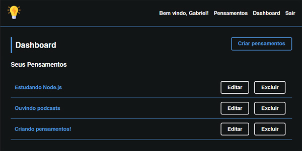
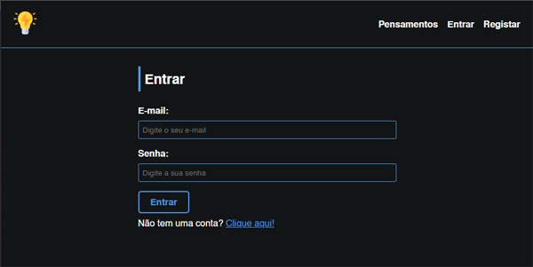
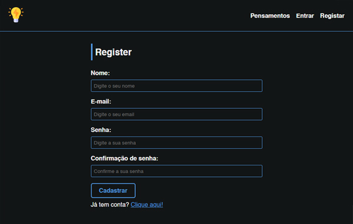
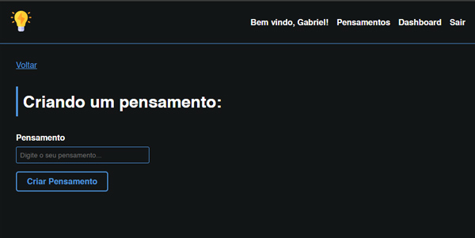

# Toughts
<h1 align="center"></h1>
Um estudo de Node.js, MySQL, Express e Handlebars

## Tecnologias 👩‍💻

- Node.Js
- Express
- Handlebars
- Cookie Session
- MySQL
- Sequelize

## Funcionalidades 🛠️

- [x]  Criar conta de usuário
- [x]  Logar e deslogar
- [x]  Manter usuário logado
- [x]  Criar pensamentos
- [x]  Editar pensamentos
- [x]  Excluir pensamentos
- [x]  Procurar pensamentos
- [x]  Ordenar pensamentos

## Screenshots 📷
<h2 align="center"></h2>
<h2 align="center"></h2>
<h2 align="center"></h2>
<h2 align="center"></h2>
<h2 align="center"></h2>

## Como usar 🤔

1.  Clone o repositório: `git clone https://github.com/Moscarde/Toughts`
2.  Instale as dependências: `npm install`
3.  Execute o script: `npm start`

## Limitações ⚠️

É necessário configurar o banco de dados mysql no arquivo "/db/conn.js"